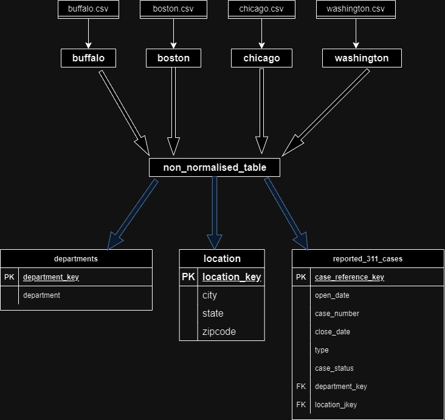

# 📞 311 Call Data Analysis Project

This project analyzes and models 311 non-emergency service request data from four U.S. cities: **Boston**, **Buffalo**, **Chicago**, and **Washington**. It demonstrates my ability to clean and transform real-world datasets, normalize relational structures, perform exploratory data analysis (EDA), and apply a basic machine learning model for predictive insights.

---

## 📌 Project Objectives

- Combine and clean multiple city-wise 311 datasets
- Normalize the data into a structured relational format
- Analyze trends in request types, resolution times, and departmental workloads
- Predict the resolution status of 311 cases using a Naive Bayes classifier

---

## 🧠 Skills Demonstrated

- **Data Cleaning & Integration**: Merged multiple raw CSV files into a single consistent dataset
- **Relational Data Modeling**: Designed normalized tables for department, location, and case data
- **EDA & Visualization**: Identified key patterns and insights using `pandas` and `matplotlib`
- **Machine Learning**: Built a classification model to predict resolution outcomes using `scikit-learn`
- **Notebook Documentation**: Explained the workflow step-by-step in Jupyter Notebook

---

## 🧰 Technologies Used

| Tool | Purpose |
|------|---------|
| Python | Core scripting language |
| Pandas & NumPy | Data manipulation and cleaning |
| SQLite | Structuring normalized tables |
| Matplotlib | Visualizations |
| scikit-learn | Naive Bayes classification |
| Jupyter Notebook | Interactive analysis and reporting |

---

## 🗂️ Project Files

- `final_code.ipynb`: Full notebook with data processing, analysis, and modeling
- `flowchart.jpg`: ER diagram showing normalized data schema

---

## 🔍 Highlights

- Combined 4 city datasets into one unified format
- Created normalized schema with tables: `departments`, `locations`, and `reported_311_cases`
- Identified top complaint types and most burdened departments
- Used a Naive Bayes model to predict if a case will be resolved or remain open
- Included visual summaries of key findings

---

## 🖼️ Data Model Overview

---

## 🚀 Key Outcomes

- Streamlined diverse datasets into a relational model
- Performed insightful analysis on 311 case patterns
- Built a predictive model with performance evaluation
- Reinforced end-to-end data project workflow

---

## 📍 About the Project

311 call data provides insights into non-emergency services requested by citizens across different U.S. cities. This project simulates how municipalities can use historical 311 data to understand public service demand, optimize departmental workflows, and predict resolution timelines. The dataset is modeled relationally and analyzed to support city planning and resource allocation.

---

